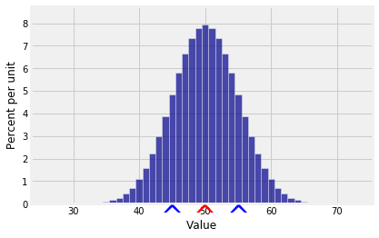

---
redirect_from:
  - "/chapter-13/02-sums-of-iid-samples"
interact_link: notebooks/Chapter_13/02_Sums_of_IID_Samples.ipynb
title: 'Sums of IID Samples'
prev_page:
  url: /Chapter_13/01_Properties_of_Covariance
  title: 'Properties of Covariance'
next_page:
  url: /Chapter_13/03_Sums_of_Simple_Random_Samples
  title: 'Sums of Simple Random Samples'
comment: "***PROGRAMMATICALLY GENERATED, DO NOT EDIT. SEE ORIGINAL FILES IN /notebooks***"
---

## Sums of IID Samples

After the dry, algebraic discussion of the previous section it is a relief to finally be able to compute some variances.

Let $X_1, X_2, \ldots X_n$ be random variables with sum
$$
S_n = \sum_{i=1}^n X_i
$$
The variance of the sum is

$$
\begin{align*}
Var(S_n) &= Cov(S_n, S_n) \\
&= \sum_{i=1}^n\sum_{j=1}^n Cov(X_i, X_j) ~~~~ \text{(bilinearity)} \\
&= \sum_{i=1}^n Var(X_i) + \mathop{\sum \sum}_{1 \le i \ne j \le n} Cov(X_i, X_j)
\end{align*}
$$

We say that the variance of the sum is the sum of all the variances and all the covariances.

If $X_1, X_2 \ldots , X_n$ are independent, then all the covariance terms in the formula above are 0. 

Therefore if $X_1, X_2, \ldots, X_n$ are independent then
$$
Var(S_n) = \sum_{i=1}^n Var(X_i)
$$

Thus for independent random variables $X_1, X_2, \ldots, X_n$, both the expectation and the variance add up nicely:

$$
E(S_n) = \sum_{i=1}^n E(X_i), ~~~~~~ Var(S_n) = \sum_{i=1}^n Var(X_i)
$$

When the random variables are i.i.d., this simplifies even further.

### Sum of an IID Sample
Let $X_1, X_2, \ldots, X_n$ be i.i.d., each with mean $\mu$ and $SD$ $\sigma$. You can think of $X_1, X_2, \ldots, X_n$ as draws at random with replacement from a population, or the results of independent replications of the same experiment.

Let $S_n$ be the sample sum, as above. Then

$$
E(S_n) = n\mu ~~~~~~~~~~ Var(S_n) = n\sigma^2 ~~~~~~~~~~ SD(S_n) = \sqrt{n}\sigma
$$

This implies that as the sample size $n$ increases, the distribution of the sum $S_n$ shifts to the right and is more spread out.

Here is one of the most important applications of these results.

### Variance of the Binomial
Let $X$ have the binomial $(n, p)$ distribution. We know that 
$$
X = \sum_{i=1}^n I_j
$$
where $I_1, I_2, \ldots, I_n$ are i.i.d. indicators, each taking the value 1 with probability $p$. Each of these indicators has expectation $p$ and variance $pq = p(1-p)$. Therefore

$$
E(X) = np ~~~~~~~~~~ Var(X) = npq ~~~~~~~~~~ SD(X) = \sqrt{npq}
$$

For example, if $X$ is the number of heads in 100 tosses of a coin, then

$$
E(X) = 100 \times 0.5 = 50 ~~~~~~~~~~ SD(X) = \sqrt{100 \times 0.5 \times 0.5} = 5
$$

Here is the distribution of $X$. You can see that there is almost no probability outside the range $E(X) \pm 3SD(X)$.


{:.input_area}
```python
k = np.arange(25, 75, 1)
binom_probs = stats.binom.pmf(k, 100, 0.5)
binom_dist = Table().values(k).probability(binom_probs)
Plot(binom_dist, show_ev=True, show_sd=True)
```


{:.output .output_png}



