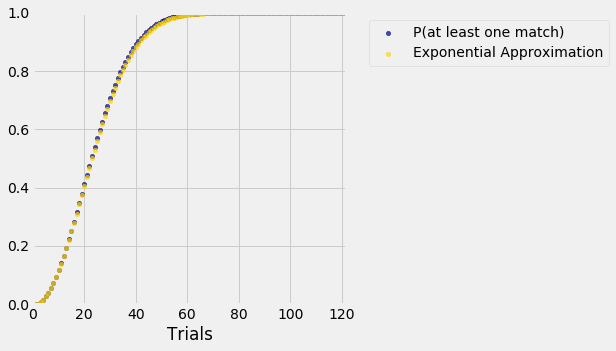

## An Exponential Approximation

The goal of this section is to understand how the chance of at least one collision behaves as a function of the number of individuals $n$, when there are $N$ hash values and $N$ is large compared to $n$. 

We know that chance is

$$
P(\text{at least one collision}) ~=~ 1 ~-~ \prod_{i=0}^{n-1} \frac{N-i}{N}
$$

While this gives an exact formula for the chance, it doesn't give us a sense of how the function grows. Let's see if we can develop an approximation with a form that is simpler and therefore easier to study.

The main steps in the approximation will be used repeatedly in this course, so we will set them out in some detail here.

### Step 1. Only Approximate Terms that Need Approximation

While this might seem obvious, it's worth noting as it can save a lot of unnecessary fiddling. We are trying to approximate
$$
1 ~-~ \prod_{i=0}^{n-1} \frac{N-i}{N}
$$
so all we need to approximate is
$$
\prod_{i=0}^{n-1} \frac{N-i}{N}
$$
We can subtract the approximation from 1 at the end.

In other words, we'll approximate $P(\text{no collision})$ instead. 

### Step 2. Use $\log$ to Convert Products to Sums
Our formula is a product, but we are much better at working with sums. The `log` function helps us turn the product into a sum:

$$
\log (P(\text{no collision})) ~=~ \sum_{i=0}^{n-1} \log(\frac{N-i}{N})
$$

Once we have an approximation to $\log (P(\text{no collision}))$, we can use exponentiation to convert it to an approximation for what we want, which is $P(\text{no collision})$.

### Step 3. Use Properties of $\log$
This is usually the step where the main calculation happens. Remember that $\log(1+x) \sim x$ for small $x$, where the symbol $\sim$ here means that the ratio of the two sides goes to 1 as $x$ goes to 0. The approximation might not be great for larger $x$ but let's try it out anyway.

$$
\begin{align*}
\log(P(\text{no collision})) ~ &=~ \sum_{i=0}^{n-1} \log(\frac{N-i}{N}) \\
&=~ \sum_{i=0}^{n-1} \log(1 - \frac{i}{N}) \\
&\sim ~ \sum_{i=0}^{n-1} (- \frac{i}{N}) \\
&=~ -\frac{1}{N} \sum_{i=0}^{n-1} i \\ \\
&= - \frac{1}{N} \cdot \frac{(n-1)n}{2}
\end{align*}
$$

by the formula for the sum of the first $n-1$ positive integers.

### Step 4. Invert as Needed to Complete the Approximation
The hard work has been done, and now we just have to clean things up. Step 3 gave us

$$
\log(P(\text{no collision})) ~\sim ~ - \frac{1}{N} \cdot \frac{(n-1)n}{2}
$$

and so by exponentiation on both sides we get

$$
P(\text{no collision}) ~\sim ~ e^{- \frac{1}{N} \cdot \frac{(n-1)n}{2}}
~=~
e^{- (n-1)n/2N } ~ \sim ~ e^{-n^2/2N}
$$

Finally,
$$
P(\text{at least one collision}) ~\sim ~ 1 - e^{- \frac{(n-1)n}{2N}}
~ \sim ~ 1 - e^{-n^2/2N}
$$

Now you can see why the $P(\text{at least one collision})$ rises sharply as a function of the number of people. Remember that $N$ is fixed and $n$ varies between 1 and $N$. As $n$ increases, $(n-1)n$ increases fast, essentially like $n^2$. So $-n^2/2N$ decreases fast, which makes $e^{-n^2/2N}$ drop sharply; and that makes $1 - e^{-n^2/2N}$ shoot up.

It's worth noting that there is only one approxmation in the entire calculation: it's in the line in the middle of Step 3, where we use $\log(1+x) \sim x$ for small $x$. We will encounter this approximation several times in the course.

### How Good is the Approximation?
To see how the exponential approximation compares with the exact probabilities, let's work in the context of birthdays; you can change $N$ in the code if you prefer a different setting. 

To see the entire sequence of steps, we will redo our exact calculations and augment them with a column of approximations. We'll use the somewhat more careful approximation of the two above.


{:.input_area}
```python
N = 365 

def p_no_match(n):
    individuals_array = np.arange(n)
    return np.prod((N - individuals_array)/N)

trials = np.arange(1, N+1, 1)
results = Table().with_column('Trials', trials)
different = results.apply(p_no_match, 'Trials')

results = results.with_columns(
    'P(at least one match)', 1 - different,
    'Exponential Approximation', 1 - np.e**( -(trials - 1)*trials/(2*N) )
)

results
```


<div markdown="0">
<table border="1" class="dataframe">
    <thead>
        <tr>
            <th>Trials</th> <th>P(at least one match)</th> <th>Exponential Approximation</th>
        </tr>
    </thead>
    <tbody>
        <tr>
            <td>1     </td> <td>0                    </td> <td>0                        </td>
        </tr>
        <tr>
            <td>2     </td> <td>0.00273973           </td> <td>0.00273598               </td>
        </tr>
        <tr>
            <td>3     </td> <td>0.00820417           </td> <td>0.00818549               </td>
        </tr>
        <tr>
            <td>4     </td> <td>0.0163559            </td> <td>0.016304                 </td>
        </tr>
        <tr>
            <td>5     </td> <td>0.0271356            </td> <td>0.0270254                </td>
        </tr>
        <tr>
            <td>6     </td> <td>0.0404625            </td> <td>0.0402629                </td>
        </tr>
        <tr>
            <td>7     </td> <td>0.0562357            </td> <td>0.0559104                </td>
        </tr>
        <tr>
            <td>8     </td> <td>0.0743353            </td> <td>0.0738438                </td>
        </tr>
        <tr>
            <td>9     </td> <td>0.0946238            </td> <td>0.0939222                </td>
        </tr>
        <tr>
            <td>10    </td> <td>0.116948             </td> <td>0.115991                 </td>
        </tr>
    </tbody>
</table>
<p>... (355 rows omitted)</p>
</div>


The first 10 approximations look pretty good. Let's take a look at some more.


{:.input_area}
```python
results.scatter('Trials')
plt.xlim(0, N/3)
plt.ylim(0, 1);
```





On the scale of this graph, the blue dots (the exact values) are almost indistinguishable from the gold (our exponential approximation). You can run the code again with the less careful approximation that replaces $(n-1)n$ by $n^2$ and see that the approximation is still excellent.

What we learn from the second form of the approximation is that the chance that there is at least one collision among the $n$ assigned values is essentially $1 - e^{-cn^2}$ where $c$ is a positive constant. 

We will encounter the function $1 - e^{-cx^2}$ again when we study the *Rayleigh distribution* later in the course.
