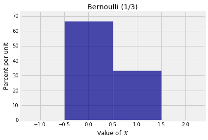

# Random Counts

These form a class of random variables that are of fundamental importance in probability theory. You have seen some examples already: the number of matches (fixed points) in a random permutation of $n$ elements is an example of a "random count", as is the number of good elements in a simple random sample. 

The general setting is that there are a number of trials, each of which can be a success or a failure. The random count is the number of successes among all the trials.

The distribution of the number of successes depends on the underlying assumptions of randomness. In this chapter we will study independent, identically distributed trials. Neither the matching problem nor simple random sampling fits this framework. However, we will see that both of these settings can be closely approximated by independent trials under some conditions on the parameters.

Finally, we will discover some remarkable properties of random counts when the number of trials is itself random. Data science includes many powerful methods that are based on randomizing parameters.

Let's start off with the simplest random count, that is a count that can only be either 0 or 1.

### Indicators and the Bernoulli $(p)$ Distribution
Consider a trial that can only result in one success or one failure. The number of successes $X$ is thus a zero-one valued random variable and is said to have the *Bernoulli $(p)$ distribution* where $p = P(X = 1)$ is the probability of success. 

This very simple random count $X$ is called the *indicator of success* on the trial.

Here is the probability histogram of a random variable $X$ that has the Bernoulli $(1/3)$ distribution.


{:.input_area}
```python
bern_1_3 = Table().values([0,1]).probability([2/3, 1/3])
Plot(bern_1_3)
plt.xlabel('Value of $X$')
plt.title('Bernoulli (1/3)');
```





### Counting is the Same as Adding Zeros and Ones

Consider a sequence of $n$ trials and for $1 \le i \le n$ let $X_i$ be the indicator of success on Trial $i$. 

The sum $S_n = X_1 + X_2 + \cdots + X_n$ is then the total number of successes in the $n$ trials. For example, if $n=3$ and $X_1 = 0$, $X_2 = 0$, and $X_3 = 1$, then there is one success in the three trials and $S_3 = 1$. As you increase the number of trials, the count stays level at every $i$ for which $X_i = 0$, and increases by 1 at each $i$ for which $X_i = 1$.

We will start out by assuming that all the $X_i$'s are i.i.d. That is, trials are mutually independent and the chance of success in a fixed trial is the same for all trials.

To fix such an example in your mind, think of the trials as being 7 rolls of a die, and let $X_i$ be the indicator of getting a six on roll $i$. Each $X_i$ has the Bernoulli $(1/6)$ distribution and all the $X_i$'s are independent. Their sum $S_7$ is the number of sixes in the 7 rolls. 
