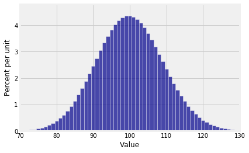
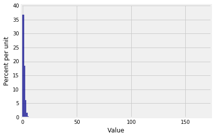
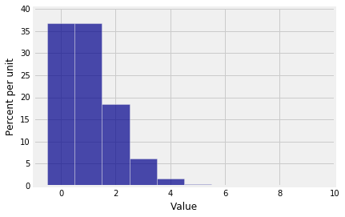

## The Binomial Distribution

Let $X_1, X_2, \ldots , X_n$ be i.i.d. Bernoulli $(p)$ random variables and let $S_n = X_1 + X_2 \ldots + X_n$. That's a formal way of saying:
- Suppose you have a fixed number $n$ of success/failure trials; and
- the trials are independent; and
- on each trial, the probability of success is $p$.
- Let $S_n$ be the total number of successes.

The first goal of this section is to find the distribution of $S_n$. 

In the example that we fixed our minds on earlier, we are counting the number of sixes in 7 rolls of a die. The 7 rolls are independent of each other, the chance of "success" (getting a six) is $1/6$ on each trial, and $S_7$ is the number of sixes.

The first step in finding the distribution of any random variable is to identify the possible values of the variable. In $n$ trials, the smallest number of successes you can have is 0 and the largest is $n$. So the set of possible values of $S_n$ is $\{0, 1, 2, \ldots , n\}$.

Thus the number of sixes in 7 rolls can be any integer in the 0 through 7 range. Let's find $P(S_7 = 3)$.

Partition the event $\{S_7 = 3\}$ into the different ways it can happen. One way can be denoted SSSFFFF, where S denotes "success" (or "six"), and F denotes failure. Another is SFFSSFF. And so on.

Now notice that 

$$
P(\text{SSSFFFF}) = 
\big{(}\frac{1}{6}\big{)}^3 \big{(}\frac{5}{6}\big{)}^4
= P(\text{SFFSSFF})
$$
by independence. Indeed, any sequence of three S's and four F's has the same probability. So by the addition rule,

$$
\begin{align*}
P(S_7 = 3) &= \text{(number of sequences that have three S and four F)} \cdot \big{(}\frac{1}{6}\big{)}^3 \big{(}\frac{5}{6}\big{)}^4 \\ \\
&= \binom{7}{3} \big{(}\frac{1}{6}\big{)}^3 \big{(}\frac{5}{6}\big{)}^4
\end{align*}
$$

because $\binom{7}{3}$ counts the number of ways you can choose 3 places out of 7 in which to put the symbol S, with the remaining 4 places being filled with F.

An analogous argument leads us to one of the most important distributions in probability theory.

### The Binomial $(n, p)$ Distribution
Let $S_n$ be the number of successes in $n$ independent Bernoulli $(p)$ trials. Then $S_n$ has the *binomial distribution with parameters $n$ and $p$*, defined by

$$
P(S_n = k) = \binom{n}{k} p^k (1-p)^{n-k}, ~~~ k = 0, 1, \ldots, n
$$

Parameters of a distribution are constants associated with it. The Bernoulli $(p)$ distribution has parameter $p$. The binomial distribution defined above has parameters $n$ and $p$ and is referred to as the binomial $(n, p)$ distribution for short. You should check that the Bernoulli $(p)$ distribution is the same as the binomial $(1, p)$ distribution.

Before we get going on calculations with the binomial distribution, let's make a few observations.

- The functional form of the probabilities is symmetric in successes and failures, because

$$
P(S_n = k) = \frac{n!}{k!(n-k)!} p^k (1-p)^{n-k}, ~~~ k = 0, 1, \ldots, n
$$

That's "number of trials factorial; divided by number of successes factorial times number of failures factorial; times the probability of success to the power number of successes; times the probability of failure to the power number of failures."

- The formula makes sense for the edge cases $k=0$ and $k=n$. We can calculate $P(S_n = 0)$ without any of the machinery developed above. It's the chance of no successes, which is the chance of all failures, which is $(1-p)^n$. Our formula says
$$
P(S_n = 0) = \frac{n!}{0!(n-0)!} p^0 (1-p)^{n-0} = (1-p)^n
$$
after all the dust clears in the formula; the first two factors are both 1. You can check that $P(S_n = n) = p^n$, the
chance that all the trials are successes.

Remember that $0! = 1$ by definition. In part, it is defined that way to make the formula for $\binom{n}{k}$ work out correctly when $k=0$. 

- The probabilities in the distribution sum to 1. To see this, recall that for any two numbers $a$ and $b$,

$$
\begin{align*}
(a+b)^2 &= a^2 + 2ab + b^2 \\
(a+b)^3 &= a^3 + 3a^2b + 3ab^2 + b^3 \\
\ldots \\
(a+b)^n &= \sum_{k=0}^n \binom{n}{k} a^k b^{n-k}
\end{align*}
$$

by the *binomial expansion* of $(a+b)^n$. The numbers $\binom{n}{k}$ are the elements of Pascal's triangle, as you will have seen in a math class.

Plug in $a = p$ and $b = 1-p$ and notice that the terms in the sum are exactly the binomial probabilities we defined above. So the sum of the probabilities is

$$
\sum_{k=0}^n \binom{n}{k} p^k (1-p)^{n-k}
~ = ~ \big{(} p + (1-p) \big{)}^n ~ = ~ 1^n ~ = ~ 1
$$

### Binomial Probabilities in Python
`SciPy` is a system for scientific computing, based on Python. The `stats` submodule of `scipy` does numerous calculations in probability and statistics. We will be importing it at the start of every notebook from now on.


{:.input_area}
```python
from scipy import stats
```


The function `stats.binom.pmf` takes three arguments: $k$, $n$, and $p$, in that order. It returns the numerical value of $P(S_n = k)$ For short, we will say that the function returns the binomial $(n, p)$ probability of $k$.

The acronym "pmf" stands for "probability mass function" which as we have noted earlier is sometimes used as another name for the distribution of a variable that has finitely many values.

The chance of 3 sixes in 7 rolls of a die is
$\binom{7}{3}(1/6)^3(5/6)^4$ by the binomial formula, which works out to about 8% by the calculation below.


{:.input_area}
```python
stats.binom.pmf(3, 7, 1/6)
```


{:.output_data_text}
```
0.078142861225422938
```


You can also specify an array or list of values of $k$, and `stats.binom.pmf` will return an array consisting of all their probabilities.


{:.input_area}
```python
stats.binom.pmf([2, 3, 4], 7, 1/6)
```


{:.output_data_text}
```
array([ 0.23442858,  0.07814286,  0.01562857])
```


Thus to find $P(2 \le S_7 \le 4)$, you can use


{:.input_area}
```python
sum(stats.binom.pmf([2, 3, 4], 7, 1/6))
```


{:.output_data_text}
```
0.32820001714677649
```


### Binomial Histograms
To visualize binomial distributions we will use the `prob140` method `Plot`, by first using `stats.binom.pmf` to calculate the binomial probabilities. The cell below plots the distribution of $S_7$ above. Notice how we start by specifying all the possible values of $S_7$ in the array `k`.


{:.input_area}
```python
n = 7
p = 1/6
k = np.arange(n+1)
binom_7_1_6 = stats.binom.pmf(k, n, p)
binom_7_1_6_dist = Table().values(k).probability(binom_7_1_6)
Plot(binom_7_1_6_dist)
```


Not surprisingly, the graph shows that in 7 rolls of a die you are most likely to get around 1 six.

This distribution is not symmetric, as you would expect. But something interesting happens to the distribution of the number of sixes when you increase the number of rolls.


{:.input_area}
```python
n = 600
p = 1/6
k = np.arange(n+1)
binom_600_1_6 = stats.binom.pmf(k, n, p)
binom_600_1_6_dist = Table().values(k).probability(binom_600_1_6)
Plot(binom_600_1_6_dist)
```


This distribution is close to symmetric, even though the die has only a 1/6 chance of showing a six.

Also notice that while the the *possible* values of the number of sixes range from 0 to 600, the *probable* values are in a much smaller range. The `plt.xlim` function allows us to zoom in on the probable values. The semicolon is just to prevent Python giving us a message that clutters up the graph. The `edges=True` option forces `Plot` to draw lines separating the bars; by default, it stops doing that if the number of bars is large.


{:.input_area}
```python
Plot(binom_600_1_6_dist, edges=True)
plt.xlim(70, 130);
```





But the binomial $(n, p)$ distribution doesn't always look bell shaped if $n$ is large.

Something quite different happens if for example your random variable is the number of successes in 600 independent trials that have probability 1/600 of success on each trial. Then the distribution of the number of successes is binomial $(600, 1/600)$, which looks like this:


{:.input_area}
```python
n = 600
p = 1/600
k = np.arange(n+1)
binom_600_1_600 = stats.binom.pmf(k, n, p)
binom_600_1_600_dist = Table().values(k).probability(binom_600_1_600)
Plot(binom_600_1_600_dist)
```





We really can't see that at all! Let's zoom in. When we set the limits on the horizontal axis, we have to account for the bar at 0 being centered at the 0 and hence starting at -0.5.


{:.input_area}
```python
Plot(binom_600_1_600_dist, edges=True)
plt.xlim(-1, 10);
```





Now you can see that in 600 independent trials with probability 1/600 of success on each trial, you are most likely to get no successes or 1 success. There is some chance that you get 2 through 4 successes, but the chance of any number of successes greater than 4 is barely visible on the scale of the graph.

Clearly, the shape of the histogram is determined by both $n$ and $p$. We will study the shape carefully in an upcoming section. But first let's see some numerical examples of using the binomial distribution.
