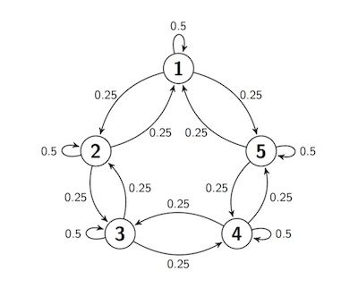

## Long Run Behavior

Every irreducible and aperiodic Markov Chain on a finite state space exhibits astonishing regularity after it has run for a while. The proof of the convergence theorem below is beyond the scope of this course, but in examples you have seen the result by computation. All the results are true in greater generality for some classes of Markov Chains on infinitely many states. 

### Convergence to Stationarity
Let $X_0, X_1, \ldots$ be an irreducible, aperiodic Markov chain on a finite state space $S$. Then for all states $i$ and $j$,

$$
P_n(i, j) \to \pi(j) ~~~ \text{as } n \to \infty
$$

In other words, for every $i$ and $j$ in $S$, the $n$-step transition probability from $i$ to $j$ converges to a limit that does not depend on $i$. Moreover,

- $\pi(j) > 0$ for all states $j$, and

- $\sum_{j \in S} \pi(j) = 1$

That is, as $n \to \infty$, every row of the $n$-step transition matrix $\mathbb{P}^n$ converges to the same vector $\pi$ which is a probability distribution in which all the terms are positive.

### Properties of the Limit

**(i)** The vector $\pi$ is the unique solution of the *balance equations* $\pi \mathbb{P} = \pi$.

**(ii)** If for some $n$ the distribution of $X_n$ is $\pi$, then the distribution of $X_m$ is also $\pi$ for all $m > n$. Thus $\pi$ is called the *stationary* or *steady state* distribution of the chain.

**(iii)** For each state $j$, the $j$th entry of the $\pi$ vector $\pi(j)$ is the expected long run proportion of time the chain spends at $j$.

We will assume that the convergence theorem is true; then the other properties follow rather easily. In the remainder of this section we will establish the properties and see how they are used.

### Balance Equations
Let $n \ge 0$ and let $i$ and $j$ be two states. Then

$$
P_{n+1}(i, j) = \sum_{k \in S} P_n(i, k)P(k, j)
$$

Therefore

$$
\begin{align*}
\lim_{n \to \infty} P_{n+1}(i, j) &= \lim_{n \to \infty} \sum_{k \in S} P_n(i, k)P(k, j) \\ \\
&= \sum_{k \in S} \big{(} \lim_{n \to \infty} P_n(i, k) \big{)} P(k, j)
\end{align*}
$$

We can exchange the limit and the sum because $S$ is finite. Now apply the theorem on convergence to stationarity:

$$
\pi(j) = \sum_{k \in S} \pi(k)P(k, j)
$$

These are called the *balance equations*.

In matrix notation, if you think of $\pi$ as a row vector, these equations become

$$
\pi = \pi \mathbb{P} ~~~~~ \text{or, as we will usually write it,} ~~~~~ \pi\mathbb{P} = \pi
$$

This helps us compute $\pi$ without taking limits.

**Note:** The steady state isn't an element of the state space $S$. It's the condition of the chain after it has been run for a long time. Let's examine this further. 

### Balance and Steady State
To see what is being "balanced" in these equations, imagine a large number of independent replications of this chain. For example, imagine a large number of particles that are moving among the states 1 through 5 according to the transition probabilities of the sticky reflecting walk, and suppose all the particles are moving at instants 1, 2, 3, $\ldots$ independently of each other.

Then at any instant and for any state $j$, there is some proportion of particles that is leaving $j$, and another proportion that is entering $j$. The balance equations say that those two proportions are equal.

Let's check this by looking at the equations again. For any state $j$,

$$
\pi(j) = \sum_{k \in S} \pi(k)P(k, j)
$$

For every $k \in S$ (including $k=j$), think of $\pi(k)$ as the proportion of particles leaving state $k$ after the chain has been run a long time. Then the left hand side is the proportion leaving $j$. The generic term in the sum on the right is the proportion that left $k$ at the previous instant and are moving to $j$. The sum is all the particles entering $j$. When the two sides are equal, the chain is *balanced*. 

The theorem on convergence to stationarity says that the chain approaches balance as $n$ gets large. If it actually achieves balance, that is, if the distribution of $X_n$ is equal to $\pi$ for some $n$, then it stays balanced. The reason:

$$
P(X_{n+1} = j) = \sum_{i \in S} P(X_n = i)P(i, j) = \sum_{i \in S} \pi(i)P(i, j) = \pi(j)
$$

by the balance equations. Now use induction.

In particular, if you start the chain with its stationary distribution $\pi$, then the distribution of $X_n$ is $\pi$ for every $n$.

### Uniqueness
It's not very hard to show that if a probability distribution solves the balance equations, then it has to be $\pi$, the limit of the marginal distributions of $X_n$. We won't do the proof; it essentially repeats the steps we took to derive the balance equations. You should just be aware that an irreducible, aperiodic, finite state Markov Chain has exactly one stationary distribution.

This is particularly helpful if you happen to guess a solution to the balance equations. If the solution that you have guessed is a probability distribution, you have found the stationary distribution of the chain.

### Expected Long Run Proportion of Time
Let $j$ be a state, and let $I_m(j)$ be the indicator of the event $\{X_m = j\}$. The *proportion of time the chain spends at $j$*, from time 1 through time $n$, is

$$
\frac{1}{n} \sum_{m=1}^n I_m(j)
$$

Therefore, the *expected proportion of time the chain spends at $j$*, given that it started at $i$, is

$$
\frac{1}{n} \sum_{m=1}^n E(I_m(j) \mid X_0 = i) 
= \frac{1}{n} \sum_{m=1}^n P(X_m = j \mid X_0 = i) 
= \frac{1}{n} \sum_{m=1}^n P_m(i, j)
$$

Now recall a property of convergent sequences of real numbers: 

- If $x_n \to x$ as $n \to \infty$, then the sequence of averages also converges to $x$. That is,

$$
\frac{1}{n} \sum_{m=1}^n x_m \to x ~~~ \text{as } n \to \infty
$$

Take $x_n = P_n(i, j)$. Then by the theorem on convergence to stationarity,

$$
P_n(i, j) \to \pi(j) ~~~ \text{as } n \to \infty
$$

and hence the averages also converge:

$$
\frac{1}{n} \sum_{m=1}^n P_m(i, j) \to \pi(j) ~~~ \text{as } n \to \infty
$$

Thus the long run expected proportion of time the chain spends in state $j$ is $\pi(j)$, where $\pi$ is the stationary distribution of the chain.

### Stationary Distribution of Sticky Reflecting Walk
We studied this in an earlier section. The transition diagram is


Here is the transition matrix $\mathbb{P}$.


{:.input_area}
```python
reflecting_walk
```


<div markdown="0">
<div>
<style scoped>
    .dataframe tbody tr th:only-of-type {
        vertical-align: middle;
    }

    .dataframe tbody tr th {
        vertical-align: top;
    }

    .dataframe thead th {
        text-align: right;
    }
</style>
<table border="1" class="dataframe">
  <thead>
    <tr style="text-align: right;">
      <th></th>
      <th>1</th>
      <th>2</th>
      <th>3</th>
      <th>4</th>
      <th>5</th>
    </tr>
  </thead>
  <tbody>
    <tr>
      <th>1</th>
      <td>0.50</td>
      <td>0.50</td>
      <td>0.00</td>
      <td>0.00</td>
      <td>0.00</td>
    </tr>
    <tr>
      <th>2</th>
      <td>0.25</td>
      <td>0.50</td>
      <td>0.25</td>
      <td>0.00</td>
      <td>0.00</td>
    </tr>
    <tr>
      <th>3</th>
      <td>0.00</td>
      <td>0.25</td>
      <td>0.50</td>
      <td>0.25</td>
      <td>0.00</td>
    </tr>
    <tr>
      <th>4</th>
      <td>0.00</td>
      <td>0.00</td>
      <td>0.25</td>
      <td>0.50</td>
      <td>0.25</td>
    </tr>
    <tr>
      <th>5</th>
      <td>0.00</td>
      <td>0.00</td>
      <td>0.00</td>
      <td>0.50</td>
      <td>0.50</td>
    </tr>
  </tbody>
</table>
</div>
</div>


The `MarkovChain` method `steady_state` returns the stationary distribution $\pi$. You saw earlier that this is the limit of the rows of $\mathbb{P}$.


{:.input_area}
```python
reflecting_walk.steady_state()
```


<div markdown="0">
<table border="1" class="dataframe">
    <thead>
        <tr>
            <th>Value</th> <th>Probability</th>
        </tr>
    </thead>
    <tbody>
        <tr>
            <td>1    </td> <td>0.125      </td>
        </tr>
        <tr>
            <td>2    </td> <td>0.25       </td>
        </tr>
        <tr>
            <td>3    </td> <td>0.25       </td>
        </tr>
        <tr>
            <td>4    </td> <td>0.25       </td>
        </tr>
        <tr>
            <td>5    </td> <td>0.125      </td>
        </tr>
    </tbody>
</table>
</div>


We could also solve for $\pi$ using the balance equations. While this might seem superfluous given that Python has already given us $\pi$, it is good practice for when transition matrices are larger and not numerical.

According to the balance equations,

$$
\pi(1) = \sum_{k=1}^s \pi(k)P(k, 1)
$$

That is, we're multiplying $\pi$ by the `1` column of $\mathbb{P}$ and adding. So

$$
\pi(1) = \pi(1)\cdot 0.5 ~ + ~ \pi(2) \cdot 0.25 = 0.5\pi(1) + 0.25\pi(2)
$$

Follow the same process to get all five balance equations:

$$
\begin{align*}
\pi(1) &= 0.5\pi(1) + 0.25\pi(2) \\
\pi(2) &= 0.5\pi(1) + 0.5\pi(2) + 0.25\pi(3) \\
\pi(3) &= 0.25\pi(2) + 0.5\pi(3) + 0.25\pi(4) \\
\pi(4) &= 0.25\pi(3) + 0.5\pi(4) + 0.5\pi(5) \\
\pi(5) &= 0.25\pi(4) + 0.5\pi(5)
\end{align*}
$$

Some observations make the system easy to solve.
- By rearranging the first equation, we get $\pi(2) = 2\pi(1)$.
- By symmetry, $\pi(1) = \pi(5)$ and $\pi(2) = \pi (4)$.
- Because $\pi(2) = \pi(4)$, the equation for $\pi(3)$ shows that $\pi(3) = \pi(2) = \pi(4)$.

So the distribution $\pi$ is

$$
\big{(} \pi(1), 2\pi(1), 2\pi(1), 2\pi(1), \pi(1) \big{)}
$$

As $\pi$ is a probability distribution, it sums to 1. Its total is $8\pi(1)$, so we have

$$
\pi = \big{(} \frac{1}{8}, \frac{2}{8}, \frac{2}{8}, \frac{2}{8}, \frac{1}{8} \big{)}
$$

This implies that in the long run, the lazy reflecting random walk of this section is expected to spend about 12.5% of its time at state 1, 25% of its time at each of states 2, 3, and 4, and the remaining 12.5% of its time at state 5.

### Sticky Random Walk on a Circle
Now let the state space be five points arranged on a circle. Suppose the process starts at Point 1, and at each step either stays in place with probability 0.5 (and thus is sticky), or moves to one of the two neighboring points with chance 0.25 each, regardless of the other moves. 

In other words, this walk is just the same as the sticky reflecting walk, except that $1 \rightarrow 5$ and $5 \rightarrow 1$ transitions are both possible. This transition behavior can be summed up in a transition diagram. Notice that the transition behavior is the same for all the states.



At every step, the next move is determined by a random choice from among three options and by the chain's current location, not on how it got to that location. So the process is a Markov chain. Let's call it $X_0, X_1, X_2, \ldots $ and define its transition matrix.


{:.input_area}
```python
s = np.arange(1, 6)

def circle_walk_probs(i, j):
        if i-j == 0:
            return 0.5
        elif abs(i-j) == 1:
            return 0.25
        elif abs(i-j) == 4:
            return 0.25
        else:
            return 0   
        
circle_walk = MarkovChain.from_transition_function(s, circle_walk_probs)
```


{:.input_area}
```python
circle_walk
```


<div markdown="0">
<div>
<style scoped>
    .dataframe tbody tr th:only-of-type {
        vertical-align: middle;
    }

    .dataframe tbody tr th {
        vertical-align: top;
    }

    .dataframe thead th {
        text-align: right;
    }
</style>
<table border="1" class="dataframe">
  <thead>
    <tr style="text-align: right;">
      <th></th>
      <th>1</th>
      <th>2</th>
      <th>3</th>
      <th>4</th>
      <th>5</th>
    </tr>
  </thead>
  <tbody>
    <tr>
      <th>1</th>
      <td>0.50</td>
      <td>0.25</td>
      <td>0.00</td>
      <td>0.00</td>
      <td>0.25</td>
    </tr>
    <tr>
      <th>2</th>
      <td>0.25</td>
      <td>0.50</td>
      <td>0.25</td>
      <td>0.00</td>
      <td>0.00</td>
    </tr>
    <tr>
      <th>3</th>
      <td>0.00</td>
      <td>0.25</td>
      <td>0.50</td>
      <td>0.25</td>
      <td>0.00</td>
    </tr>
    <tr>
      <th>4</th>
      <td>0.00</td>
      <td>0.00</td>
      <td>0.25</td>
      <td>0.50</td>
      <td>0.25</td>
    </tr>
    <tr>
      <th>5</th>
      <td>0.25</td>
      <td>0.00</td>
      <td>0.00</td>
      <td>0.25</td>
      <td>0.50</td>
    </tr>
  </tbody>
</table>
</div>
</div>


Because of the symmetry of the transition behavior, no state should be occupied more than any other state, and hence all the $\pi(j)$'s should be equal. This is confirmed by `steady_state`.


{:.input_area}
```python
circle_walk.steady_state()
```


<div markdown="0">
<table border="1" class="dataframe">
    <thead>
        <tr>
            <th>Value</th> <th>Probability</th>
        </tr>
    </thead>
    <tbody>
        <tr>
            <td>1    </td> <td>0.2        </td>
        </tr>
        <tr>
            <td>2    </td> <td>0.2        </td>
        </tr>
        <tr>
            <td>3    </td> <td>0.2        </td>
        </tr>
        <tr>
            <td>4    </td> <td>0.2        </td>
        </tr>
        <tr>
            <td>5    </td> <td>0.2        </td>
        </tr>
    </tbody>
</table>
</div>


