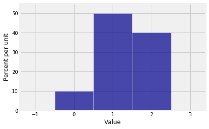
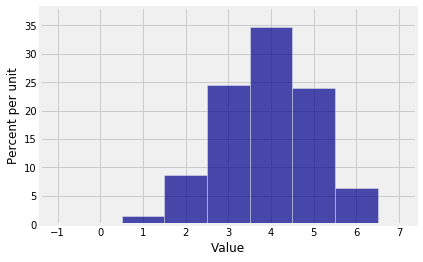
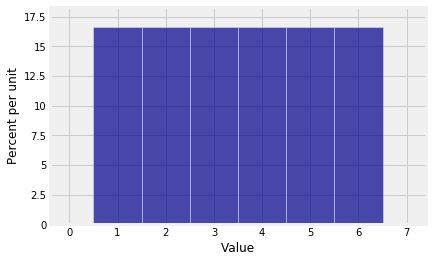
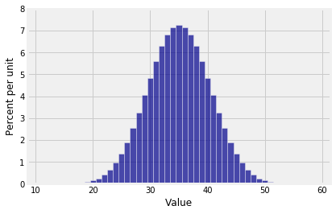
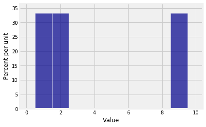
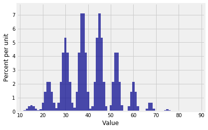
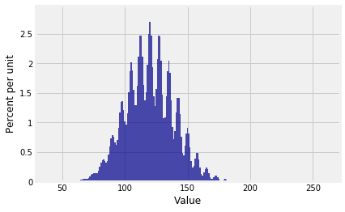
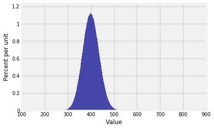

## PGFs in NumPy

Recall our algorithm to find the distribution of $S_n$, the sum of $n$ i.i.d. copies of a random variable $X_1$ that has values in a finite set of non-negative integers.

- Start with the pgf of $X_1$.
- Raise it to the power $n$. That's the pgf of $S_n$.
- Read the distribution of $S_n$ off the pgf.

In this section we will use `NumPy` to carry out this algorithm.

Suppose the distribution of $X_1$ is given by $p_0 = 0.1$, $p_1 = 0.5$, $p_2 = 0.4$. Let `probs_X1` be an array containing the probabilities of the values 0, 1, and 2.


{:.input_area}
```python
probs_X1 = make_array(0.1, 0.5, 0.4)
```


{:.input_area}
```python
dist_X1 = Table().values(np.arange(3)).probability(probs_X1)
Plot(dist_X1)
```





The pgf of $X_1$ is
$$
0.1 + 0.5s + 0.4s^2
$$

`NumPy` expresses this polynomial in the standard mathematical way, leading with the term of the highest degree:

$$
0.4s^2 + 0.5s + 0.1
$$

The method `np.flipud` reverses the array of probabilities to be consistent with this order of coefficients. The `ud` in the name is for "up down". `NumPy` is thinking of the array as a column.


{:.input_area}
```python
coeffs_X1 = np.flipud(probs_X1)
coeffs_X1
```


{:.output_data_text}
```
array([ 0.4,  0.5,  0.1])
```


The method `np.poly1d` takes the array of coefficients as its argument and constructs the polynomial. The `1d` in the name stands for "one dimensional".


{:.input_area}
```python
pgf_X1 = np.poly1d(coeffs_X1)
print(pgf_X1)
```


{:.output_stream}
```
     2
0.4 x + 0.5 x + 0.1

```

The call to `print` displays the polynomial in retro typewriter style, using $x$ where we have been using $s$. Keep in mind that the final term is the coefficient of $x^0$.

Now suppose $S_3$ is the sum of three i.i.d. copies of $X_1$. The pgf of $S_3$ is the cube of the pgf of $X_1$ and can be calculated just as you would hope.


{:.input_area}
```python
pgf_S3 = pgf_X1**3
print(pgf_S3)
```


{:.output_stream}
```
       6        5         4         3         2
0.064 x + 0.24 x + 0.348 x + 0.245 x + 0.087 x + 0.015 x + 0.001

```

The possible values of $S_3$ are 0 through 6 because $S_3$ is the sum of three copies of a variable that takes values 0 through 2. The coefficients are the probabilities in the distribution of $S_3$. 

You can extract an array of the coefficients by using a polynomial attribute called `c` for "coefficients".


{:.input_area}
```python
coeffs_S3 = pgf_S3.c
coeffs_S3
```


{:.output_data_text}
```
array([ 0.064,  0.24 ,  0.348,  0.245,  0.087,  0.015,  0.001])
```


These are the probabilities of the values 6 down to 0. In probability theory it is more natural to think of the probabilities of values in the sequence 0 through 6, so use `np.flipud` again:


{:.input_area}
```python
probs_S3 = np.flipud(coeffs_S3)
probs_S3
```


{:.output_data_text}
```
array([ 0.001,  0.015,  0.087,  0.245,  0.348,  0.24 ,  0.064])
```


You now have the inputs you need for drawing the probability histogram of $S_3$.


{:.input_area}
```python
dist_S3 = Table().values(np.arange(7)).probability(probs_S3)
Plot(dist_S3)
```





### A Function to Calculate the Distribution of $S_n$
We will combine the steps above to create a function `dist_sum` that takes as its arguments the number of terms $n$ and the probabilities in the distribution of $X_1$, and returns the distribution of the sum of $n$ i.i.d. copies of $X_1$.


{:.input_area}
```python
def dist_sum(n, probs_0_through_N):
    """Return the distribution of S_n,
    the sum of n i.i.d. copies
    of a random variable with distribution probs_0_through_N
    on the integers 0, 1, 2, ..., N"""
    
    # Find the possible values of S_n
    N = len(probs_0_through_N) - 1   
    values_Sn = np.arange(n*N + 1)
    
    # Find the probailities of those values
    coeffs_X1 = np.flipud(probs_0_through_N)
    pgf_X1 = np.poly1d(coeffs_X1)
    pgf_Sn = pgf_X1**n
    coeffs_Sn = pgf_Sn.c
    probs_Sn = np.flipud(coeffs_Sn)
    
    t = Table().with_columns(
        'Value', values_Sn,
        'Probability', probs_Sn
    )
    return t
```


### The Sum of the Numbers on $n$ Rolls of a Die
In Chapter 3 we found the exact distribution of the sum of five rolls of a die by listing all $6^5$ possible outcomes and computing the sum for each of them. That method gets intractable with larger numbers of rolls. Let's see if our new method can find the distribution of the sum of 10 rolls of a die.

We have to start with the distribution of a single roll, for which it is important to remember to include 0 as the probability of 0 spots. Otherwise the pgf will be wrong because `NumPy` won't know that it is not supposed to include a term of degree 0.


{:.input_area}
```python
die = np.append(0, (1/6)*np.ones(6))
die
```


{:.output_data_text}
```
array([ 0.        ,  0.16666667,  0.16666667,  0.16666667,  0.16666667,
        0.16666667,  0.16666667])
```


{:.input_area}
```python
Plot(dist_sum(1, die))
```





{:.input_area}
```python
Plot(dist_sum(10, die))
```





### Making Waves
The distribution of the sum of 10 rolls of a die looks beautifully normal. Do all sums have roughly normal distributions? 

To explore this question, let $X_1$ have the distribution given by $p_1 = p_2 = p_9 = 1/3$.


{:.input_area}
```python
probs_X1 = make_array(0, 1/3, 1/3, 0, 0, 0, 0, 0, 0, 1/3)
```


Here is the distribution of $X_1$.


{:.input_area}
```python
Plot(dist_sum(1, probs_X1))
```





The probability histogram of $S_{10}$ shows that sums don't always have smooth distributions.


{:.input_area}
```python
Plot(dist_sum(10, probs_X1))
```





The distribution of $S_{30}$ looks like a stegosaurus having a bad hair day.


{:.input_area}
```python
Plot(dist_sum(30, probs_X1))
```





And the distribution of $S_{100}$ is ...


{:.input_area}
```python
Plot(dist_sum(100, probs_X1))
```





... beautifully normal. 

It's begining to look as though there's a theorem here. In the rest of the chapter we will study that theorem, which about the approximate distribution of the sum of a large i.i.d. sample.

Keep in mind that our pgf method gives the *exact* distribution of the sum of an i.i.d. sample from a distribution on finitely many non-negative integers, provided `NumPy` can handle the calculations. In the example above, the pgf of $S_{100}$ is a polynomial of degree 900. `NumPy` handled it just fine.
