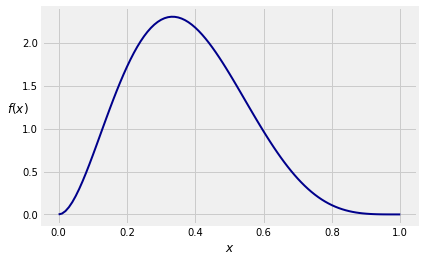
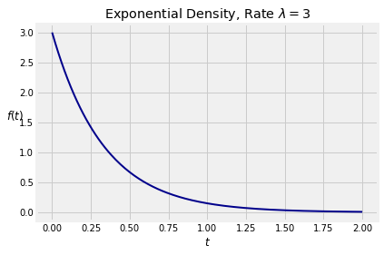

## Calculus in SymPy

Working with densities involves calculus which can sometimes be time-consuming. This course gives you two ways of reducing the amount of calculus involved.

- Probabilistic methods can help reduce algebra and calculus. You've seen this with algebra in the discrete case. You'll see it with calculus as we learn more about densities.
- Python has a symbolic math module called `SymPy` that does algebra, calculus, and much other symbolic math. In this section we will show you how to do calculus using `SymPy`.

We will demonstrate the methods in the context of an example. Suppose $X$ has density given by

$$
f(x) = 
\begin{cases}
105x^2(1-x)^4 ~~~ \text{if } 0 \le x \le 1 \\
0 ~~~~~~~~~ \text{otherwise}
\end{cases}
$$

As you can see from its graph below, $f$ could be used to model the distribution of a random proportion that you think is likely to be somewhere between 0.2 and 0.4.





The density $f$ is a polynomial on the unit interval, and in principle the algebra and calculus involved in integrating it are straightforward. But they are tedious. So let's get `SymPy` to do the work.

First, we will import all the functions in `SymPy` and set up some printing methods that make the output look nicer than the retro typewritten pgf output you saw in a previous section. In future sections of this text, you can assume that this importing and initialization will have been done at the start.


{:.input_area}
```python
from sympy import *
init_printing()
```


Next, we have to create tell Python that an object is symbolic. In our example, the variable $x$ is the natural candidate to be a symbol. You can use `Symbol` for this, by using the argument `'x'`. We have assinged the symbol to the name `x`.


{:.input_area}
```python
x = Symbol('x')
```


Now we will assign the name `density` to the expression that defines $f$. The expression looks just like a numerical calculation, but the output is algebraic!


{:.input_area}
```python
density = 105 * x**2 * (1-x)**4
density
```


$$105 x^{2} \left(- x + 1\right)^{4}$$


That's the expression for $f(x)$ defined by the equation at the start of the section. Notice that what we naturally think of as $1 - x$ is expressed as $-x + 1$. That's because `SymPy` is writing the polynomial leading with the term of highest degree.

Let's not simply accept that this function is a density. Let's check that it is a density by integrating it from 0 to 1. To display this, we use the method `Integral` that takes the name of a function and a *tuple* (a sequence in parentheses) consisting of the variable of integration and the lower and upper limits of integration. We have assigned this integral to the name `total_area`.


{:.input_area}
```python
total_area = Integral(density, (x, 0, 1))
total_area
```


$$\int_{0}^{1} 105 x^{2} \left(- x + 1\right)^{4}\, dx$$


The output of displays the integral, which is nice, but what we really want is its numerical value. In `SymPy`, this is achieved by abruptly instructing the method to `doit()`.


{:.input_area}
```python
total_area.doit()
```


$$1$$


This confirms that the function $f$ is a density.

We can use `Integral` to find the chance that $X$ is in any interval. Here is $P(0.2 < X < 0.4)$.


{:.input_area}
```python
prob_02_04 = Integral(density, (x, 0.2, 0.4)).doit()
prob_02_04
```


$$0.432064000000001$$


For $x$ in the unit interval, the cdf of $X$ is

$$
F(x) ~ = ~ P(X \le x) ~ = ~ \int_0^x f(s)ds ~ = ~ I(s)~ \Big{\rvert}_0^x ~ = ~ I(x) - I(0)
$$

where $I$ is the indefinite integral of $f$.

To get the indefinite integral, simply ask `SymPy` to integrate the density; there are no limits of integration.


{:.input_area}
```python
indefinite = Integral(density).doit()
indefinite
```


$$15 x^{7} - 70 x^{6} + 126 x^{5} - 105 x^{4} + 35 x^{3}$$


Now $F(x) = I(x) - I(0)$. You can see at a glance that $I(0) = 0$ but here is how `SymPy` would figure that out.

To evaluate $I(0)$, `SymPy` must substitute $x$ with 0 in the expression for $I$. This is achieved by the method `subs` that takes the variable as its first argument and the specified value as the second.


{:.input_area}
```python
I_0 = indefinite.subs(x, 0)
I_0
```


$$0$$


{:.input_area}
```python
cdf = indefinite - I_0
cdf
```


$$15 x^{7} - 70 x^{6} + 126 x^{5} - 105 x^{4} + 35 x^{3}$$


To find the value of the cdf at a specified point, say 0.4, we have to substitute $x$ with 0.4 in the formula for the cdf. 


{:.input_area}
```python
cdf_at_04 = cdf.subs(x, 0.4)
cdf_at_04
```


$$0.580096000000001$$


Thus $P(X \le 0.4)$ is roughly 58%. Earlier we calulated $P(0.2 < X < 0.4) = 43.2\%$, which we can confirm by using the cdf:


{:.input_area}
```python
cdf_at_02 = cdf.subs(x, 0.2)
cdf_at_04 - cdf_at_02
```


$$0.432064000000001$$


The expectation $E(X)$ is a definite integral from 0 to 1:


{:.input_area}
```python
expectation = Integral(x*density, (x, 0, 1)).doit()
expectation
```


$$\frac{3}{8}$$


Notice how simple the answer is. Later in the course, you will see why.

Here is $E(X^2)$, which turns out to be another simple fraction. Clearly, the density $f$ has interesting properties. We will study them later. For now, let's just get the numerical answers.


{:.input_area}
```python
expected_square = Integral((x**2)*density, (x, 0, 1)).doit()
expected_square
```


$$\frac{1}{6}$$


Now you can find $SD(X)$.


{:.input_area}
```python
sd = (expected_square - expectation**2)**0.5
sd
```


$$0.161374306091976$$


### SymPy and the Exponential Density
One of the primary distributions in probability theory, the exponential distribution has a positive parameter $\lambda$ known as the "rate", and density given by

$$
f(t) ~ = \lambda e^{-\lambda t}, ~~~ t \ge 0
$$

The density is 0 on the negative numbers. Here is its graph when $\lambda = 3$.





To check that $f$ is a density, we have to confirm that its integral is 1. We will start by constructing two symbols, `t` and `lamda`. Notice the incorrectly spelled `lamda` instead of `lambda`. That is because `lambda` has another meaning in Python, as some of you might know.

Note the use of `positive=True` to specify that the symbol can take on only positive values.


{:.input_area}
```python
t = Symbol('t', positive=True)
lamda = Symbol('lamda', positive=True)
```


Next we construct the expression for the density. Notice the use of `exp` for the exponential function. 


{:.input_area}
```python
expon_density = lamda * exp(-lamda * t)
expon_density
```


$$\lambda e^{- \lambda t}$$


To see that the function is a density, we can check that its integral from 0 to $\infty$ is 1. The symbol that `SymPy` uses for $\infty$ is `oo`, a double lower case o. It looks very much like $\infty$.


{:.input_area}
```python
Integral(expon_density, (t, 0, oo)).doit()
```


$$1$$


Suppose $T$ has the exponential $(\lambda)$ density. Then for $t \ge 0$ the cdf of $T$ is 

$$
F_T(t) ~ = ~ P(T \le t) ~ = ~ \int_0^t \lambda e^{-\lambda s}ds
$$

This is a straightforward integral that you can probably do in your head. However, let's get some more practice using `SymPy` to find cdf's.
We will use the same method that we used to find the cdf in the previous example.

$$
\int_0^t \lambda e^{-\lambda s}ds ~ = ~ I(t) - I(0)
$$

where $I$ is the indefinite integral of the density. To get this indefinite integral we will use `Integral` as before, except that this time we must specify `t` as the variable of integration. That is because `SymPy` sees two symbols `t` and `lamda` in the density, and doesn't know which one is the variable unless we tell it.


{:.input_area}
```python
indefinite = Integral(expon_density, t).doit()
indefinite
```


$$- e^{- \lambda t}$$


Now use $F_T(t) = I(t) - I(0)$:


{:.input_area}
```python
I_0 = indefinite.subs(t, 0)
I_0
```


$$-1$$


{:.input_area}
```python
cdf = indefinite - I_0
cdf
```


$$1 - e^{- \lambda t}$$


Thus the cdf of $T$ is

$$
F_T(t) ~ = ~ 1 - e^{-\lambda t}
$$

The expectation of $T$ is

$$
E(T) ~ = ~ \int_0^\infty t \lambda e^{-\lambda t} dt ~ = ~ \frac{1}{\lambda}
$$

which you can check by integration by parts. But `SymPy` is faster:


{:.input_area}
```python
expectation = Integral(t*expon_density, (t, 0, oo)).doit()
expectation
```


$$\frac{1}{\lambda}$$


Calculating $E(T^2)$ is just as easy.


{:.input_area}
```python
expected_square = Integral(t**2 * expon_density, (t, 0, oo)).doit()
expected_square
```


$$\frac{2}{\lambda^{2}}$$


The variance and SD follow directly.


{:.input_area}
```python
variance = expected_square - (expectation ** 2)
variance
```


$$\frac{1}{\lambda^{2}}$$


{:.input_area}
```python
sd = variance ** 0.5
sd
```


$$\frac{1}{\lambda^{1.0}}$$


That's a pretty funny way of writing $\frac{1}{\lambda}$ but we'll take it. It's a small price to pay for not having to do all the integrals by hand.
