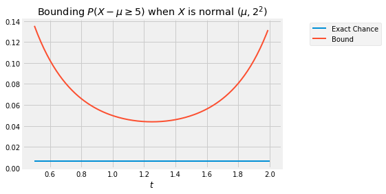

## Chernoff Bound

If the form of a distribution is intractable in that it is difficult to find exact probabilities by integration, then good estimates and bounds become important. Bounds on the tails of the distribution of a random variable help us quantify roughly how close to the mean the random variable is likely to be. 

We already know two such bounds. Let $X$ be a random variable with expectation $\mu$ and SD $\sigma$.

#### Markov's Bound on the Right Hand Tail
If $X$ is non-negative, 
$$
P(X \ge c) ~  \le ~ \frac{\mu}{c}
$$

#### Chebychev's Bound on Two Tails
$$
P(\lvert X - \mu\rvert \ge c) ~ \le ~ \frac{\sigma^2}{c^2}
$$

Moment generating functions can help us improve upon these bounds in many cases. In what follows, we will assume that the moment generating function of $X$ is finite over the whole real line. If it is finite only over a smaller interval around 0, the calculations of the mgf below should be confined to that interval.

### Chernoff Bound on the Right Tail
Observe that if $g$ is an increasing function, then the event $\{ X \ge c \}$ is the same as the event $\{ g(X) \ge g(c)\}$. 

For any fixed $t > 0$, the function defined by $g(x) = e^{tx}$ is increasing as well as non-negative. So for each $t > 0$,

$$
\begin{align*}
P(X \ge c) ~ &= P(e^{tX} \ge e^{tc}) \\
&\le ~ \frac{E(e^{tX})}{e^{tc}} ~~~~ \text{(Markov's bound)} \\
&= ~ \frac{M_X(t)}{e^{tc}}
\end{align*}
$$

This is the first step in developing a [Chernoff bound](https://en.wikipedia.org/wiki/Chernoff_bound) on the right hand tail. 

For the next step, notice that you can choose $t$ to be any positive number. Some choices of $t$ will give sharper bounds than others. Because these are upper bounds, the sharpest among all of the bounds will correspond to the value of $t$ that minimizes the right hand side. So the Chernoff bound has an *optimized* form:

$$
P(X \ge c) ~ \le ~ \min_{t > 0} \frac{M_X(t)}{e^{tc}}
$$

### Application to the Normal Distribution

Suppose $X$ has the normal $(\mu, \sigma^2)$ distribution and we want to get a sense of how far $X$ can be above the mean. Fix $c > 0$. The exact chance that the value of $X$ is at least $c$ above the mean is

$$
P(X - \mu \ge c) ~ = ~ 1 - \Phi(c/\sigma)
$$

because the distribution of $X - \mu$ is normal $(0, \sigma^2)$. This exact answer looks neat and tidy, but the standard normal cdf $\Phi$ is not easy to work with analytically. Sometimes we can gain more insight from a good bound.

The optimized Chernoff bound is

$$
\begin{align*}
P(X- \mu \ge c) ~ &\le ~ \min_{t > 0} \frac{M_{X-\mu}(t)}{e^{tc}} \\ \\
&= ~ \min_{t > 0} \frac{e^{\sigma^2t^2/2}}{e^{tc}} \\ \\
&= ~ \min_{t > 0} e^{-ct + \sigma^2t^2/2}
\end{align*}
$$

The curve below is the graph of $\exp(-ct + \sigma^2t^2/2)$ as a function of $t$, in the case $\sigma = 2$ and $c = 5$. The flat line is the exact probability of $P(X - \mu \ge c)$. The curve is always above the flat line: no matter what $t$ is, the bound is an upper bound. The sharpest of all the upper bounds corresponds to the minimizing value $t^*$ which is somewhere in the 1.2 to 1.3 range.

To find the minimizing value of $t$ analytically, we will use the standard calculus method of minimization. But first we will simplify our calculations by observing that finding the point at which a positive function is minimized is the same as finding the point at which the log of the function is minimized. This is because $\log$ is an increasing function.

So the problem reduces to finding the value of $t$ that minimizes the function $h(t) = -ct + \sigma^2t^2/2$. By differentiation, the minimizing value of $t$ solves

$$
c ~ = ~ \sigma^2 t^*
$$
and hence
$$
t^* ~ = ~ \frac{c}{\sigma^2}
$$

So the Chernoff bound is 
$$
P(X - \mu \ge c) ~ \le ~ e^{-ct^* + \sigma^2{t^*}^2/2} ~ = ~ e^{-c^2/2\sigma^2}
$$

Compare this with the bounds we already have. Markov's bound can't be applied directly as $X - \mu$ can have negative values. Because the distribution of $X - \mu$ is symmetric about 0, Chebychev's bound becomes

$$
P(X - \mu \ge c ) ~ \le ~ \frac{\sigma^2}{2c^2}
$$

When $c$ is large, the optimized Chernoff bound is quite a bit sharper than Chebychev's. In the case $\sigma = 2$, the graph below shows the exact value of $P(X - \mu \ge c)$ as a function of $c$, along with the Chernoff and Chebychev bounds.

### Chernoff Bound on the Left Tail
By an analogous argument we can derive a Chernoff bound on the left tail of a distribution. For a fixed $t > 0$, the function $g(x) = e^{-tx}$ is decreasing and non-negative. So for $t > 0$ and any fixed $c$,

$$
P(X \le c) ~ = ~ P(e^{-tX} \ge e^{-tc}) ~ \le ~ \frac{E(e^{-tX})}{e^{-tc}}
~ = ~ \frac{M_X(-t)}{e^{-tc}}
$$
and therefore
$$
P(X \le c) ~ \le ~ \min_{t > 0} \frac{M_X(-t)}{e^{-tc}}
$$

### Sums of Independent Random Variables
The Chernoff bound is often applied to sums of independent random variables. Let $X_1, X_2, \ldots, X_n$ be independent and let $S_n = X_1 + X_2 + \ldots + X_n$. Fix any number $c$. For every $t > 0$,

$$
P(S_n \ge c) ~ \le ~ \frac{M_{S_n}(t)}{e^{tc}} ~ = ~ \frac{\prod_{i=1}^n M_{X_i}(t)}{e^{tc}}
$$

This result is useful for finding bounds on binomial tails because the moment generating function of a Bernoulli random variable has a straightforward form. It is also used for bounding tails of sums of independent indicators with possibly different success probabilities. We will leave all this for a subsequent course.
